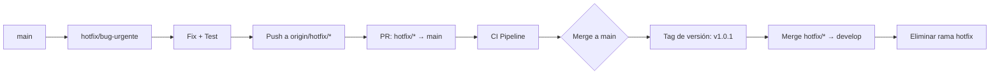

# TurnoFácil API

Microservicio para registrar y administrar reservas de atención, desarrollado con **Spring Boot 3.3** y **Java 21**.

## Integrantes

- Maximiliano Rodriguez Gamboa
- Benjamín Dattoli Peña
- Joaquín Alberto González Sánchez
- Mateo Nogueira Calvo
- Vicente Fabar

## Tecnologías

- **Java 21**
- **Spring Boot 3.3.2**
- **Spring Data JPA** (Hibernate)
- **H2 Database** (en memoria para desarrollo)
- **Spring Validation** (Bean Validation)
- **SpringDoc OpenAPI** (Swagger UI)
- **Spring Boot Actuator** (Health checks)
- **Lombok** (Reducción de boilerplate)
- **Maven** (Gestión de dependencias)
- **JUnit 5 / MockMvc** (Pruebas de integración)

## Funciones de la API

| Método | Ruta | Descripción |
| --- | --- | --- |
| `GET` | `/health` | Comprueba que la API está funcionando |
| `GET` | `/health/liveness` | Probe de vida para Kubernetes |
| `GET` | `/health/readiness` | Probe de disponibilidad para Kubernetes |
| `POST` | `/reservas` | Registra una reserva |
| `GET` | `/reservas` | Lista todas las reservas (filtro opcional `?estado=`) |
| `GET` | `/reservas/{id}` | Busca una reserva por su identificador |

---

## 🌿 Estrategia de Ramificación: GitFlow

### Justificación de la elección

Este proyecto adopta **GitFlow** como modelo de ramificación por las siguientes razones:

| Criterio | GitFlow | GitHub Flow | Trunk-Based |
|----------|---------|-------------|-------------|
| **Entregas planificadas** | ✅ Releases explícitos | ❌ Continuo | ⚠️ Feature flags |
| **Hotfixes a producción** | ✅ Rama `hotfix/*` dedicada | ⚠️ Desde main | ⚠️ Desde main |
| **Desarrollo paralelo** | ✅ `develop` + `feature/*` | ✅ `feature/*` | ✅ Ramas cortas |
| **Trazabilidad completa** | ✅ Historial claro de releases | ⚠️ Solo main | ⚠️ Requiere disciplina |
| **Adecuado para equipos** | ✅ Roles claros | ✅ Simple | ⚠️ Requiere CI/CD maduro |

**GitFlow fue elegido porque:**
1. **Entregas controladas**: El microservicio requiere versiones trazables para auditoría
2. **Hotfixes independientes**: Correcciones urgentes en producción sin afectar `develop`
3. **Colaboración en parejas**: Rama `develop` como integración continua, `feature/*` para trabajo aislado
4. **Estándar académico/empresarial**: Ampliamente documentado y enseñado en ingeniería de software

### Estructura de Ramas

```
main (producción) ──────●──────────────────────●──────
                         \                      /
develop (integración) ───●───●───●───●───●──────●──────
                          \   \   \   \   \    /
feature/validacion ───────●───●───●───●────●──●──────
                           \   \   \    \   \ /
feature/endpoint-salud ──────●───●───●────●──●──────
                              \   \   \    \  /
hotfix/fix-null-pointer ────────●───●──────●──●──────
```

### Ramas Obligatorias (según rúbrica)

| Rama | Propósito | Origen | Destino Merge |
|------|-----------|--------|---------------|
| `main` | Código en producción | `develop` / `hotfix/*` | — |
| `develop` | Integración continua | `feature/*` / `hotfix/*` | `main` |
| `feature/*` | Nueva funcionalidad | `develop` | `develop` |
| `hotfix/*` | Bug urgente en producción | `main` | `main` + `develop` |

---

## 📝 Convenciones de Commits

### Formato (Conventional Commits)

```
<tipo>(<alcance>): <mensaje breve>

[cuerpo opcional]

[pie opcional]
```

### Tipos Permitidos

| Tipo | Uso | Ejemplo |
|------|-----|---------|
| `feat` | Nueva funcionalidad | `feat(reserva): agrega validación @Future en fechaHora` |
| `fix` | Corrección de bug | `fix(service): normaliza estado para evitar NPE` |
| `docs` | Solo documentación | `docs(readme): actualiza guía de convenciones` |
| `test` | Agrega/modifica tests | `test(controller): agrega test para fecha pasada` |
| `refactor` | Mejora código sin cambiar comportamiento | `refactor(dto): extrae validaciones a anotaciones` |
| `chore` | Mantenimiento (deps, build, CI) | `chore(ci): agrega chmod +x mvnw en workflow` |
| `ci` | Cambios en pipeline CI/CD | `ci: configura workflow build-and-test` |
| `merge` | Merge de PR (GitHub) | `merge: feat: agrega validación @Future (#1)` |

### Ejemplos del Proyecto

```bash
# Feature 1
feat: agrega validación @Future en fechaHora para reservas

# Feature 2
feat: mejora endpoint /health con liveness, readiness y metadatos

# Hotfix
fix: normaliza estado en listarReservas para evitar NPE con espacios en blanco

# Merge commits (generados por GitHub)
merge: feat: agrega validación @Future en fechaHora para reservas (#1)
merge: feat: mejora endpoint /health con liveness, readiness y metadatos (#2)
merge: fix: normaliza estado en listarReservas para evitar NPE (#hotfix-1)
```

---

## 🔀 Flujo de Merge y Pull Requests

### Flujo para Features

```mermaid
graph LR
    A[develop] --> B[feature/nueva-funcionalidad]
    B --> C[Desarrollo + Tests]
    C --> D[Push a origin/feature/*]
    D --> E[PR: feature/* → develop]
    E --> F[CI Pipeline: Build + Test + Quality]
    F --> G{¿Checks verdes?}
    G -->|Sí| H[Code Review]
    G -->|No| C
    H --> I[Aprobar + Merge (--no-ff)]
    I --> J[Eliminar rama feature]
    J --> A
```

### Flujo para Hotfixes



### Reglas de Merge

1. **`--no-ff` obligatorio**: Preserva historial de rama y contexto del PR
2. **PR requerido**: No pushes directos a `main` ni `develop`
3. **CI verde**: Todos los checks deben pasar (build, test, quality)
4. **Code Review**: Mínimo 1 aprobación (en parejas: el otro integrante)
5. **Eliminar rama**: Tras merge, borrar `feature/*` o `hotfix/*` remota y local

---

## 👥 Estrategia de Revisión de Código (Code Review)

### Checklist de Revisión

| Categoría | Verificaciones |
|-----------|----------------|
| **Funcionalidad** | ¿Resuelve el issue? ¿Casos edge cubiertos? |
| **Tests** | ¿Nuevos tests? ¿Cobertura adecuada? ¿Tests pasan? |
| **Estilo** | ¿Convenciones de código? ¿Naming consistente? |
| **Seguridad** | ¿Sin credenciales hardcodeadas? ¿Validación entrada? |
| **Performance** | ¿Queries N+1? ¿Índices BD? ¿Caché? |
| **Documentación** | ¿JavaDoc? ¿README actualizado? ¿Swagger? |

### Comentarios Tipo

- **🔴 Bloqueante**: `Request changes` - Bug, seguridad, tests fallan
- **🟡 Sugerencia**: `Comment` - Mejora estilo, refactor, naming
- **🟢 Aprobación**: `Approve` - Código listo para merge

---

## ⚙️ Pipeline CI/CD (GitHub Actions)

### Workflow: `.github/workflows/ci.yml`

**Disparadores:**
- `push` a `develop`
- `pull_request` hacia `main`

### Jobs

| Job | Runner | Descripción | Dependencias |
|-----|--------|-------------|--------------|
| `build-and-test` | ubuntu-latest | Compila, testea, empaqueta JAR | — |
| `code-quality` | ubuntu-latest | SpotBugs + Spotless (paralelo) | — |
| `docker` | ubuntu-latest | Build imagen Docker + test container | `build-and-test` |
| `notify` | ubuntu-latest | Notificación si falla | Todos |

### Pasos Clave (build-and-test)

```yaml
- uses: actions/checkout@v4
- uses: actions/setup-java@v4 (JDK 21, Temurin, cache maven)
- run: chmod +x mvnw          # ✅ Fix crítico Linux
- run: ./mvnw clean compile
- run: ./mvnw test            # 12 tests + JaCoCo
- run: ./mvnw package -DskipTests
- uses: actions/upload-artifact (JAR, 7 días)
```

### Quality Gates

| Check | Herramienta | Umbral |
|-------|-------------|--------|
| Compilación | Maven | 0 errores |
| Tests unitarios | JUnit 5 | 100% pass |
| Cobertura | JaCoCo | Reportado (artefacto) |
| Análisis estático | SpotBugs | Warning (no bloquea) |
| Formato código | Spotless | Warning (no bloquea) |
| Imagen Docker | Dockerfile | Build + health check OK |

---

## 📁 Estructura de Carpetas

```
turnofacil-api/
├── .github/
│   └── workflows/
│       └── ci.yml                 # Pipeline CI/CD
├── src/
│   ├── main/
│   │   ├── java/com/turnofacil/api/
│   │   │   ├── TurnofacilApiApplication.java
│   │   │   ├── controller/        # Controladores REST (MVC - View/Controller)
│   │   │   │   ├── HealthController.java
│   │   │   │   └── ReservaController.java
│   │   │   ├── dto/               # Data Transfer Objects
│   │   │   │   ├── ReservaCreateRequest.java
│   │   │   │   ├── ReservaResponse.java
│   │   │   │   └── ErrorResponse.java
│   │   │   ├── exception/         # Manejo centralizado de errores
│   │   │   │   ├── BusinessException.java
│   │   │   │   ├── GlobalExceptionHandler.java
│   │   │   │   └── ReservaNotFoundException.java
│   │   │   ├── model/             # Entidades JPA (MVC - Model)
│   │   │   │   └── Reserva.java
│   │   │   ├── repository/        # Acceso a datos (Spring Data JPA)
│   │   │   │   └── ReservaRepository.java
│   │   │   └── service/           # Lógica de negocio (MVC - Service layer)
│   │   │       ├── ReservaService.java
│   │   │       └── ReservaServiceImpl.java
│   │   └── resources/
│   │       └── application.properties
│   └── test/
│       └── java/.../ReservaControllerIntegrationTest.java
├── pom.xml                        # Maven config + plugins (SpotBugs, Spotless, JaCoCo)
├── README.md                      # Esta guía
└── .gitignore                     # Excluye target/, *.jar, .idea/, etc.
```

### Arquitectura MVC Implementada

| Capa | Responsabilidad | Archivos |
|------|-----------------|----------|
| **Model** | Entidades, repositorios, datos | `model/`, `repository/` |
| **View** | DTOs Request/Response, ErrorResponse | `dto/` |
| **Controller** | Endpoints REST, validación entrada | `controller/` |
| **Service** | Lógica negocio, transacciones | `service/` |

---

## 🚀 Instalación y Ejecución

### Requisitos

- Java 21 (JDK)
- Maven 3.9+ (o `./mvnw` wrapper)

### Comandos

```bash
# Clonar repositorio
git clone https://github.com/TU_USUARIO/turnofacil-api.git
cd turnofacil-api

# Compilar y ejecutar tests
./mvnw clean test

# Ejecutar aplicación
./mvnw spring-boot:run
```

### URLs Disponibles

| Endpoint | URL |
|----------|-----|
| API Base | http://localhost:8080 |
| Swagger UI | http://localhost:8080/swagger-ui.html |
| OpenAPI Docs | http://localhost:8080/api-docs |
| Health Check | http://localhost:8080/health |
| Liveness | http://localhost:8080/health/liveness |
| Readiness | http://localhost:8080/health/readiness |
| H2 Console | http://localhost:8080/h2-console |

---

## 🧪 Pruebas

```bash
# Tests unitarios + integración
./mvnw test

# Tests con reporte de cobertura (JaCoCo)
./mvnw test jacoco:report
# Reporte en: target/site/jacoco/index.html

# Solo test específico
./mvnw test -Dtest=ReservaControllerIntegrationTest#crearReserva_shouldCreateAndReturnReserva
```

---

## 🐳 Docker

```bash
# Build imagen
docker build -t turnofacil-api:latest .

# Ejecutar contenedor
docker run -d -p 8080:8080 --name turnofacil turnofacil-api:latest

# Ver logs
docker logs -f turnofacil

# Health check
curl http://localhost:8080/health
```

**Dockerfile** (requerido en raíz):
```dockerfile
FROM eclipse-temurin:21-jre-alpine
WORKDIR /app
COPY target/turnofacil-api-0.1.0.jar app.jar
EXPOSE 8080
ENTRYPOINT ["java","-jar","app.jar"]
```

---

## 📊 Historial de Cambios Simulados (PRs)

### PR #1: `feature/validacion-reserva` → `develop`
- **Commit**: `feat: agrega validación @Future en fechaHora para reservas`
- **Cambios**: `ReservaCreateRequest.java` + test `crearReserva_shouldReturnBadRequestWhenFechaHoraIsPast`
- **Merge**: `--no-ff` a `develop`

### PR #2: `feature/endpoint-salud` → `develop`
- **Commit**: `feat: mejora endpoint /health con liveness, readiness y metadatos`
- **Cambios**: `HealthController.java` + 3 tests nuevos
- **Merge**: `--no-ff` a `develop`

### PR #3 (Hotfix): `hotfix/fix-null-pointer` → `main` + `develop`
- **Commit**: `fix: normaliza estado en listarReservas para evitar NPE con espacios en blanco`
- **Cambios**: `ReservaServiceImpl.java` + test `listarReservas_shouldHandleNullAndWhitespaceEstado`
- **Merge**: `--no-ff` a `main` (tag v0.1.1) y `develop`

---

## 🏷️ Versionado

- **Formato**: SemVer `MAJOR.MINOR.PATCH`
- **Tags**: `v0.1.0`, `v0.1.1` (hotfix), `v0.2.0` (features)
- **Release**: Merge `develop` → `main` crea tag automático

---

## 🔐 Seguridad y Buenas Prácticas

- ✅ Validación Bean Validation en DTOs (`@NotNull`, `@Size`, `@Future`)
- ✅ Manejo centralizado de errores (`@RestControllerAdvice`)
- ✅ Respuestas de error estandarizadas (`ErrorResponse`)
- ✅ Sin credenciales hardcodeadas (placeholders en `application.properties`)
- ✅ Security scan en CI (verifica placeholders y secretos)
- ✅ Principio de menor privilegio (DTOs separados de entidades)

---

## 📚 Referencias

- [GitFlow Original (Vincent Driessen)](https://nvie.com/posts/a-successful-git-branching-model/)
- [Conventional Commits](https://www.conventionalcommits.org/)
- [Spring Boot Reference](https://docs.spring.io/spring-boot/docs/current/reference/html/)
- [GitHub Actions Docs](https://docs.github.com/en/actions)

---

## 📄 Declaración de Uso de IA

> **Herramientas utilizadas**: GitHub Copilot / Claude / ChatGPT
> **Uso**: Apoyo en redacción de documentación, generación de código boilerplate (DTOs, tests, configuración Maven), diseño de pipeline CI/CD y arquitectura MVC.
> **Validación**: Todo código generado fue revisado, probado localmente (`./mvnw test`) y adaptado a los requerimientos del proyecto.
> **Reflexiones individuales**: Incluidas en sección de conclusiones por cada integrante (sin apoyo de IA).

---

## 📝 Conclusiones Individuales

### Maximiliano Rodriguez Gamboa
> *Reflexión personal sin apoyo de IA sobre aprendizaje y contribución...*

### Benjamín Dattoli Peña
> *Reflexión personal sin apoyo de IA sobre aprendizaje y contribución...*

### Joaquín Alberto González Sánchez
> *Reflexión personal sin apoyo de IA sobre aprendizaje y contribución...*

### Mateo Nogueira Calvo
> *Reflexión personal sin apoyo de IA sobre aprendizaje y contribución...*

### Vicente Fabar
> *Reflexión personal sin apoyo de IA sobre aprendizaje y contribución...*

---

**Proyecto académico - DOY0101 Ingeniería DevOps - Evaluación Parcial 1**